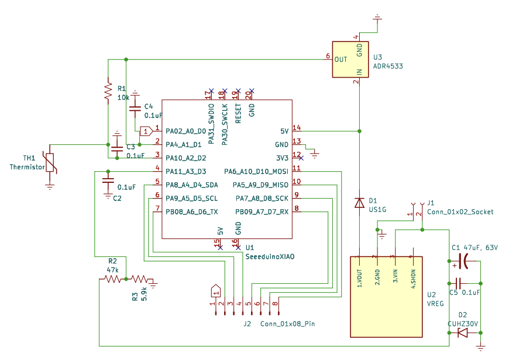

# Bumpybot-Battery-Monitor
Battery Monitoring Device designed for BumpyBot utilizing ROS-Serial and a I2C TFT Display

Designed by Jacob Tomczeszyn for The Human-Centered Robotics Laboratory at The University of Texas at Austin
  
 Designed for Adafruit QT Py M0, Reads ADC values at A2 and A3 expecting divided voltage.
 Displays undivided voltage and other derived values on Adafruit 1.12" I2C display.
 
 Acts as a ROS publisher utilizing rosserial over a USB connection the Bumpybot Computer.
 
For `BatteryState` ROS message documentation see [here](http://docs.ros.org/en/api/sensor_msgs/html/msg/BatteryState.html).


## Hardware 

### PCB
- [Schematic PDF](PCB/BumpyBotBatteryMonitorkicad_pro.pdf)

<table>
  <tr>
    <td></td>
    <td></td>  </tr>
  <tr>
    <td></td>
    <td></td>
  </tr>
</table>


### Adafruit QT Py - SAMD21 Dev Board with STEMMA QT
  - https://www.adafruit.com/product/4600
  - SeeedStudio Xiao footprint, soldered to PCB via castellated pads

### Adafruit Monochrome 1.12" 128x128 OLED Graphic Display
  - https://www.adafruit.com/product/5297
  - Connected to the Qt Py via the I2C STEMMA QT port
  - Attached to the pcb via M2.5 standoffs.

### Pololu 5V, 500mA Step-Down Voltage Regulator D24V5F5
- https://www.pololu.com/product/2843/specs
- U2 on the PCB Schematic, THT Soldered to the PCB

## Software Setup & Dependencies

[Follow instructions on setting up Arduino IDE for Adafruit SAMD21 boards](https://learn.adafruit.com/adafruit-qt-py/arduino-ide-setup)
    - This should be optional, as [arduino-cli is already installed](#compiling-and-upload-using-arduino-cli) and setup on the Bumpybot computer. This project relies on the base Arduino library, so keep that in mind if you wish to compile using a different tool.

#### From here, you should be okay to clone this reposiitory and use as-is, but if you wish to setup the dependencies seperately:

- Either use the precompiled [ros_lib library in this repository](libraries/ros_lib) or follow [instructions on compiling yourself](http://wiki.ros.org/rosserial_arduino).
- [Adafruit GFX Arduino Library](https://github.com/adafruit/Adafruit-GFX-Library)
- [Adafruit SH110X Display Driver Library](https://github.com/adafruit/Adafruit_SH110x)


#### If you wish to setup the dependencies yourself, Please see the following notes:

### ros_lib/ArduinoHardware.h
If you self-compile ros_lib, you must modify ros_lib/ArduinoHardware.h to enable ROSserial compatibility with the Adafruit QT Py M0.
Add the following lines between the first `#enddif` and the next `#if defined` near the top of the file.
The precompiled and modified [ros_lib](libraries/ros_lib) is already included in this repository, you can just use it instead of compiling it yourself.

```
#if 1
class ArduinoHardware {
  public:
    ArduinoHardware()
    {
      baud_ = 250000;
    }  
    void setBaud(long baud){
      this->baud_= baud;
    }
    int getBaud(){return baud_;}
    void init(){
      Serial.begin(baud_);
      while(!Serial.available());
    }
    int read(){return Serial.read();};
    void write(uint8_t* data, int length){
      for(int i=0; i<length; i++)
        Serial.write(data[i]);
    }
    unsigned long time(){return millis();}
  protected:
    long baud_;
};
#else
```
### Adafruit_SH110X/spash.h 
I've created a custom startup image of the Bumpybot Logo for the display.
This custom file is not necessary but is included in this repository.

## Compiling and Upload using arduino-cli
`arduino-cli` should already be set up properly already to allow for easy compilation and upload.

To compile without uploading, run:
```
arduino-cli compile -v -b adafruit:samd:adafruit_qtpy_m0 BumpyBot_AFM0_BAT_TEMP_ROSSERIAL.ino 
```
To upload, first ensure that that the monitor is connected to the Bumpybot computer via usb, and run:
```
arduino-cli board list
```
You should something like the following:
```
Port         Protocol Type              Board Name                 FQBN                           Core         
             serial   Serial Port       Unknown                                                                
/dev/ttyACM0 serial   Serial Port (USB) Adafruit QT Py M0 (SAMD21) adafruit:samd:adafruit_qtpy_m0 adafruit:samd
/dev/ttyACM1 serial   Serial Port (USB) Unknown                                                                
/dev/ttyS0   serial   Serial Port       Unknown                                                                
/dev/ttyS1   serial   Serial Port       Unknown                                                                
/dev/ttyS4   serial   Serial Port       Unknown                                                                
/dev/ttyS5   serial   Serial Port       Unknown                                                                
/dev/ttyS6   serial   Serial Port       Unknown                                                                
/dev/ttyUSB0 serial   Serial Port (USB) Unknown            
```
Noting the port, ```/dev/ttyACM0``` in this case, run the following to initiate the upload:

```
arduino-cli upload -p /dev/ttyACM0 -v -b adafruit:samd:adafruit_qtpy_m0 BumpyBot_AFM0_BAT_TEMP_ROSSERIAL.ino 
```
(Replacing ```/dev/ttyACM0``` with the correct port if necessary)

It should take a moment to upload, if you get any upload-specific error, attempt the upload again, if that doesnt work, double-press the RESET button on the QT Py board in the monitor, and try again.
    
